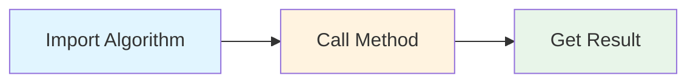
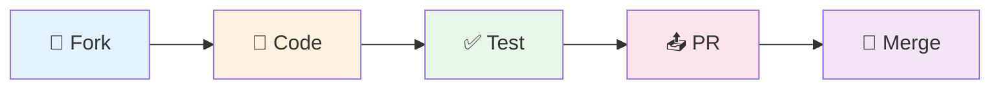

<div align="center">

# 🔷 The Algorithms - Java


### All algorithms implemented in Java (for educational purposes)

[](https://github.com/TheAlgorithms/Java/actions/workflows/build.yml)
[](https://codecov.io/gh/TheAlgorithms/Java)
[](https://discord.gg/c7MnfGFGa6)
[](https://gitpod.io/#https://github.com/TheAlgorithms/Java)

[](https://gitpod.io/#https://github.com/TheAlgorithms/Java)

---

**[📚 Explore Algorithms](DIRECTORY.md)** • **[🤝 Contributing](CONTRIBUTING.md)** • **[💬 Community](https://discord.gg/c7MnfGFGa6)**

</div>

<br>

```
┌─────────────────────────────────────────────────────────────────┐
│                                                                 │
│  📖  Educational implementations of algorithms in Java          │
│  🎯  Focus on code clarity and learning                         │
│  🧪  Comprehensive test coverage                                │
│  📝  Well-documented with JavaDoc                               │
│                                                                 │
└─────────────────────────────────────────────────────────────────┘
```

## 📖 Overview

This repository contains **Java implementations** of common algorithms and data structures. These implementations are for **learning purposes** and prioritize code clarity over performance. They may be less efficient than the Java standard library.

<details>
<summary><b>🎁 What's Inside?</b></summary>

<br>

| Feature | Description |
|---------|-------------|
| 📝 **Clean Code** | Readable implementations with clear variable names |
| 🧪 **Test Coverage** | JUnit test coverage for most algorithms |
| 📚 **Documentation** | JavaDoc comments with time/space complexity |
| ☕ **Modern Java** | Leverages Java 21 features |
| 🗂️ **Organized** | Algorithms grouped by category |

</details>

---

## 🚀 Getting Started

<table>
<tr>
<td width="50%">

### 📋 Prerequisites

```bash
☕ Java 21+
📦 Maven 3.6+
```

</td>
<td width="50%">

### ⚡ Quick Setup

```bash
git clone https://github.com/TheAlgorithms/Java.git
cd Java
mvn clean compile
mvn test
```

</td>
</tr>
</table>

---

## 💡 Usage Examples

<div align="center">



</div>

All algorithms are implemented as static methods. Import and use them directly:

<table>
<tr>
<td width="50%">

**📊 Dynamic Programming**
```java
import com.thealgorithms.dynamicprogramming.Fibonacci;

int fib = Fibonacci.fibonacci(10); // 55
```

**🔀 Sorting**
```java
import com.thealgorithms.sorts.QuickSort;

int[] array = {64, 34, 25, 12, 22, 11, 90};
QuickSort.quickSort(array, 0, array.length - 1);
```

</td>
<td width="50%">

**🌐 Graph Algorithms**
```java
import com.thealgorithms.datastructures.graphs.DijkstraAlgorithm;

int[][] graph = {{0, 4, 0}, {4, 0, 8}, {0, 8, 0}};
DijkstraAlgorithm dijkstra = new DijkstraAlgorithm(3);
int[] distances = dijkstra.run(graph, 0);
```

**📦 Data Structures**
```java
import com.thealgorithms.datastructures.stacks.BalancedBrackets;

boolean isBalanced = BalancedBrackets.isBalanced("{[()]}");
```

</td>
</tr>
</table>

---

## 📚 Algorithm Categories

<div align="center">

```
╔═══════════════════════════════════════════════════════════════╗
║                    ALGORITHM CATEGORIES                       ║
╚═══════════════════════════════════════════════════════════════╝
```

</div>

<table>
<tr>
<td width="50%" valign="top">

### 🔍 Sorting & Searching
```
├── Binary Search
├── Linear Search
├── Jump Search
├── Quick Sort
├── Merge Sort
├── Heap Sort
└── Radix Sort
```

### 🌳 Data Structures
```
├── Trees
│   ├── BST
│   ├── AVL
│   └── Red-Black
├── Graphs
│   ├── DFS / BFS
│   ├── Dijkstra
│   └── Bellman-Ford
└── Collections
    ├── Stacks
    ├── Queues
    └── Heaps
```

</td>
<td width="50%" valign="top">

### 🎯 Algorithm Techniques
```
├── Dynamic Programming
│   ├── Knapsack
│   ├── LCS
│   └── Edit Distance
├── Greedy Algorithms
├── Backtracking
│   ├── N-Queens
│   └── Sudoku Solver
└── Divide & Conquer
```

### 🔐 Other Topics
```
├── Cryptography & Ciphers
├── Mathematical Algorithms
├── String Manipulation
├── Bit Operations
└── Audio Processing
```

</td>
</tr>
</table>

<div align="center">

📋 **[View Complete Directory →](DIRECTORY.md)**

</div>

---

## 🤝 Contributing

<div align="center">



</div>

We welcome contributions! Please read our **[Contribution Guidelines](CONTRIBUTING.md)** before you contribute.

<table>
<tr>
<td width="50%">

### 🚀 Quick Start

```bash
# 1. Fork & Clone
git clone https://github.com/YOUR_USERNAME/Java.git

# 2. Create Branch
git checkout -b feature/your-algorithm

# 3. Make Changes & Commit
git commit -m "Add: Algorithm name"

# 4. Push & Create PR
git push origin feature/your-algorithm
```

</td>
<td width="50%">

### ✅ Requirements

- **JavaDoc** - Document your code
- **Tests** - Include JUnit tests
- **Style** - Follow existing patterns
- **Directory** - Update DIRECTORY.md

<br>

> ⚠️ **Note:** We do **not** accept LeetCode problems. Focus on well-known algorithms.

</td>
</tr>
</table>

---

## 🌐 Community & Support

<div align="center">

<table>
<tr>
<td align="center" width="33%">
<br>
<b>Discord</b><br>
<a href="https://discord.gg/c7MnfGFGa6">Join discussions</a>
</td>
<td align="center" width="33%">
<br>
<b>Issues</b><br>
<a href="https://github.com/TheAlgorithms/Java/issues">Report bugs</a>
</td>
<td align="center" width="33%">
<br>
<b>Website</b><br>
<a href="https://the-algorithms.com">Explore more</a>
</td>
</tr>
</table>

</div>

---

<div align="center">

## 📄 License

Licensed under the [MIT License](LICENSE).

<br>

```
╔════════════════════════════════════════════════════════╗
║  Made with ❤️ by The Algorithms Community              ║
║  ⭐ Star this repository if you find it helpful!       ║
╚════════════════════════════════════════════════════════╝
```

<br>

**[⬆ Back to Top](#-the-algorithms---java)**

</div>
