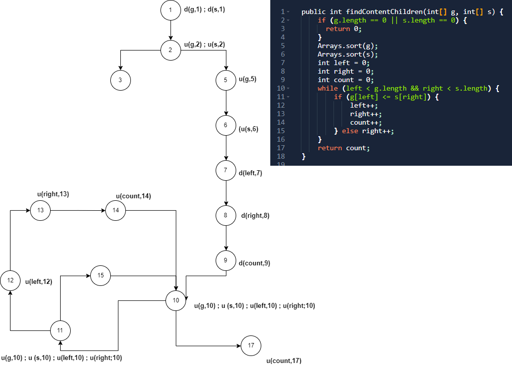

## **1. Flowchart**

## **2. Paths**
### **Variable g: (same with s)** 
#### **Path 1:** 1 &rarr; 2 &rarr; 3
#### **Path 2:** 1 &rarr; 2 &rarr; 5 &rarr; 6 &rarr; 7 &rarr; 8 &rarr; 9 &rarr; 10 &rarr; 17
#### **Path 3:** 1 &rarr; 2 &rarr; 5 &rarr; 6 &rarr; 7 &rarr; 8 &rarr; 9 &rarr; 10 &rarr; 11 &rarr; 15 &rarr; 10 &rarr; 17
#### **Path 4:** 1 &rarr; 2 &rarr; 5 &rarr; 6 &rarr; 7 &rarr; 8 &rarr; 9 &rarr; 10 &rarr; 11 &rarr; 12 &rarr; 13 &rarr; 14 &rarr; 10 &rarr; 17

### **Variable left:** 
#### **Path 1:** 7 &rarr; 8 &rarr; 9 &rarr; 10 &rarr; 17
#### **Path 2:** 7 &rarr; 8 &rarr; 9 &rarr; 10 &rarr; 11 &rarr; 15 &rarr; 10 &rarr; 17
#### **Path 3:** 7 &rarr; 8 &rarr; 9 &rarr; 10 &rarr; 11 &rarr; 12 &rarr; 13 &rarr; 14 &rarr; 10 &rarr; 17

### **Variable right:** 
#### **Path 1:** 8 &rarr; 9 &rarr; 10 &rarr; 17
#### **Path 2:** 8 &rarr; 9 &rarr; 10 &rarr; 11 &rarr; 15 &rarr; 10 &rarr; 17
#### **Path 3:** 8 &rarr; 9 &rarr; 10 &rarr; 11 &rarr; 12 &rarr; 13 &rarr; 14 &rarr; 10 &rarr; 17

### **Variable count:** 
#### **Path 1:** 9 &rarr; 10 &rarr; 17
#### **Path 2:** 9 &rarr; 10 &rarr; 11 &rarr; 15 &rarr; 10 &rarr; 17
#### **Path 3:** 9 &rarr; 10 &rarr; 11 &rarr; 12 &rarr; 13 &rarr; 14 &rarr; 10 &rarr; 17

## **3. Generate Test Case**
## **Test 1:**
#### **Input**: g = [ ] , s = [ ]
#### **Expected output**: 0
## **Test 2:**
#### **Input**: g = [ 2 ] , s = [ 1 ]
#### **Expected output**: 0
## **Test 3:**
#### **Input**: g = [ 2 ] , s = [ 2 ]
#### **Expected output**: 1