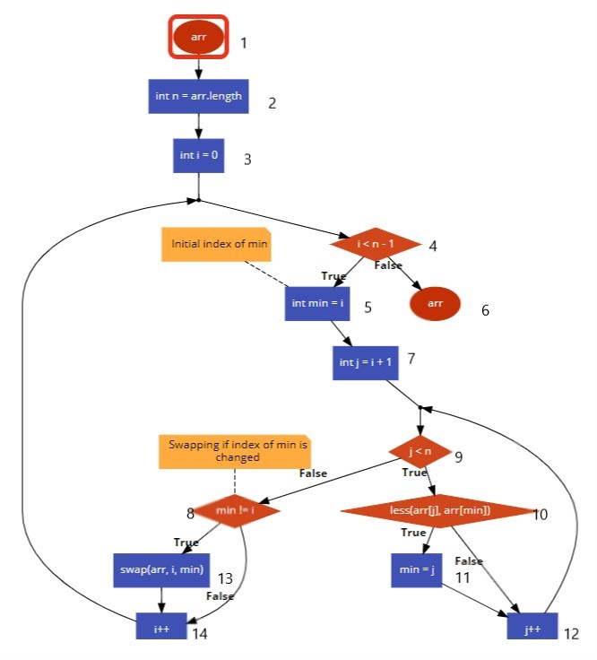

## **1. Flowchart**

## **2. Paths**
### **Variable arr :** 
#### **Path 1:** 1 &rarr; 2 &rarr; 6
#### **Path 2:** 1 &rarr; 2 &rarr; 13 &rarr; 6 
#### **Path 3:** 1 &rarr; 2 &rarr; 10 &rarr; 13 &rarr; 6

### **Variable n:** 
#### **Path 1:** 2 &rarr; 4 &rarr; 9

### **Variable i:** 
#### **Path 1:** 3 &rarr; 4
#### **Path 2:** 3 &rarr; 4 &rarr; 5 &rarr; 7 &rarr; 13 &rarr; 14 &rarr; 4
#### **Path 3:** 3 &rarr; 4 &rarr; 5 &rarr; 7 &rarr; 14 &rarr; 4
#### **Path 2:** 3 &rarr; 4 &rarr; 5 &rarr; 7 &rarr; 13 &rarr; 14 &rarr; 4

### **Variable j:** 
#### **Path 1:** 7 &rarr; 9
#### **Path 2:** 7 &rarr; 9 &rarr; 10 &rarr; 12
#### **Path 3:** 7 &rarr; 9 &rarr; 10 &rarr; 11 &rarr; 12

## **3. Generate Test Case**
## **Test 1:** 
#### **Input**: {0, 5, 9, 2, 1, 3, 4, 8, 6, 7}
#### **Expected output**: {0, 1, 2, 3, 4, 5, 6, 7, 8, 9}
## **Test 2:**
#### **Input**: {'f', 'h', 'c', 'a', 'b', 'd', 'g', 'e'}
#### **Expected output**: {'a', 'b', 'c', 'd', 'e', 'f', 'g', 'h'}
## **Test 3:**
#### **Input**: {9, 8, 7, 6, 5, 4, 3, 2, 1, 0}
#### **Expected output**: {0, 1, 2, 3, 4, 5, 6, 7, 8, 9}
## **Test 4:**
#### **Input**: {'h', 'g', 'f', 'e', 'd', 'c', 'b', 'a'}
#### **Expected output**:{'a', 'b', 'c', 'd', 'e', 'f', 'g', 'h'}
## **Test 5:**
#### **Input**: {'a', 'b', 'c', 'd', 'e', 'f', 'g', 'h'}
#### **Expected output**: {'a', 'b', 'c', 'd', 'e', 'f', 'g', 'h'}
## **Test 6:**
#### **Input**: {0, 1, 2, 3, 4, 5, 6, 7, 8, 9}
#### **Expected output**: {0, 1, 2, 3, 4, 5, 6, 7, 8, 9}